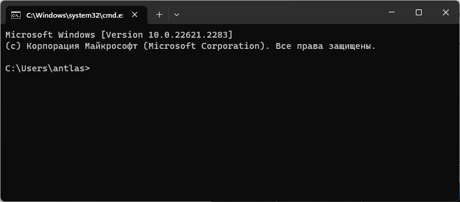
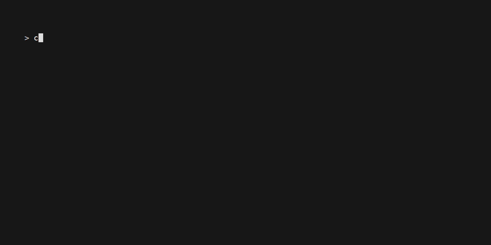
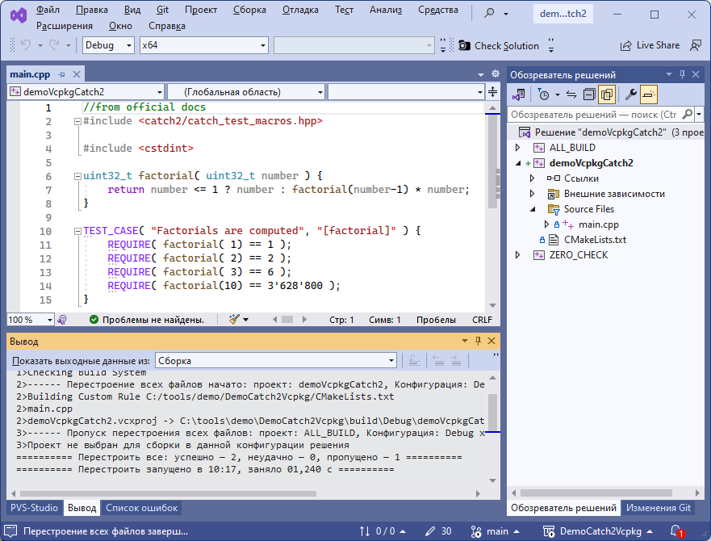
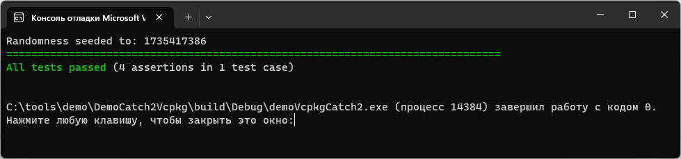

Демонстрация установки и использования catch2 с использованием vcpkg. Есть отсылка в [официальном руководстве](https://github.com/catchorg/Catch2/blob/devel/docs/cmake-integration.md#installing-catch2-from-vcpkg). 
Если ничего не получается, то есть [репозиторий с полным копированием catch2](https://github.com/antlas1/DemoCatch2Vendoring).

### Установка vcpkg
Открываем консоль windows, переходим на путь, где будет лежать менеджер, например `C:\tools\demo`. 

<details>
<summary>Как открыть консоль, если есть проблемы</summary>

* Запуск через меню Пуск:
  
  * Нажмите кнопку Пуск, которая находится в левом нижнем углу экрана
  * Найдите пункт «Командная строка» или «cmd» в списке программ
  * Нажмите на пункт «Командная строка» или «cmd» для запуска.

* Запуск через диспетчер задач:
  
  * Нажмите `Ctrl + Shift + Esc`, чтобы открыть диспетчер задач
  * Нажмите на кнопку «Файл» в верхнем левом углу и выберите «Новый задачи»
  * В поле «Открыть» наберите «cmd» и нажмите Enter.

* Запуск через Run:
  
  * Нажмите клавишу `Windows + R`
  * В появившемся окне введите «cmd» и нажмите Enter
  
  После чего вы должны увидеть примерно следующее окно:
   

</details>

Получаем проект из гита, создаём директорию сборки и устанавливаем catch2:

```
git clone https://github.com/microsoft/vcpkg
cd vcpkg
bootstrap-vcpkg.bat
vcpkg.exe install catch2:x86-windows
vcpkg.exe install catch2:x64-windows
```

Успешные шаги выглядят так:


### Сборка и проверка под Windows

Открываем консоль windows, переходим на путь, например `C:\projects`. Получаем проект из гита, создаём директорию сборки и конфигурируем для cmake+visual studio:

```
git clone https://github.com/antlas1/DemoCatch2Vcpkg.git
cd DemoCatch2Vcpkg
mkdir build
cd build
call "C:\Program Files\Microsoft Visual Studio\2022\Community\VC\Auxiliary\Build\vcvars64.bat"
cmake .. -G "Visual Studio 17 2022" -A "x64" -DCMAKE_TOOLCHAIN_FILE=C:\tools\demo\vcpkg\scripts\buildsystems\vcpkg.cmake
```

Успешные шаги выглядят так:



После конфигурации открываем в студии и собираем:



Правой кнокой на проект **demoCatch2Vcpkg**, делаем активным проектом (он выделится жирным), запускаем тесты:

