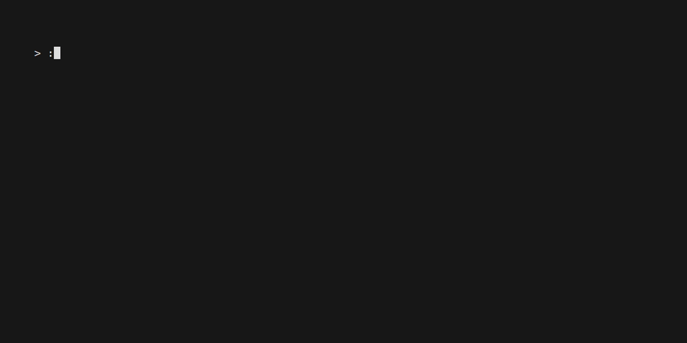
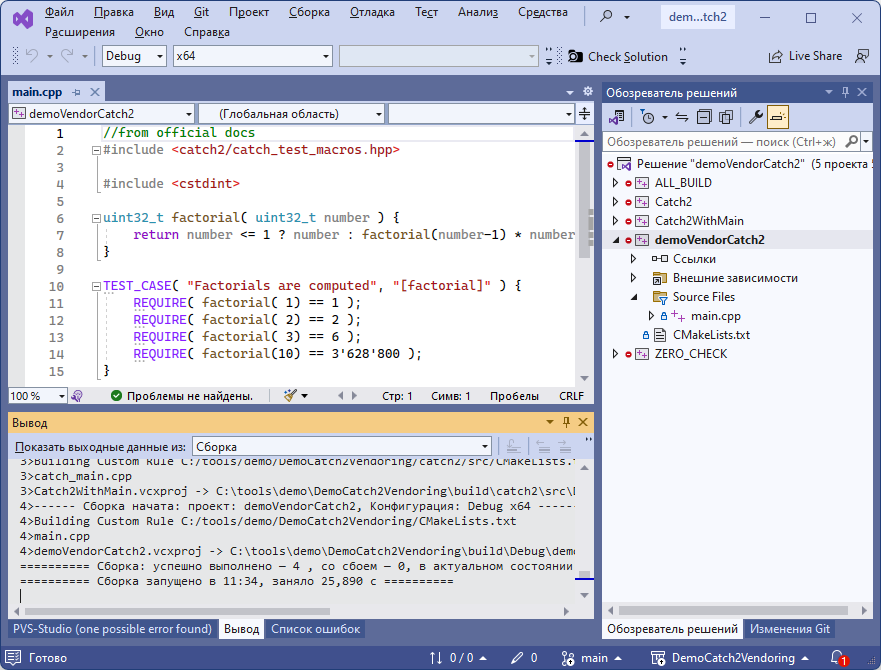
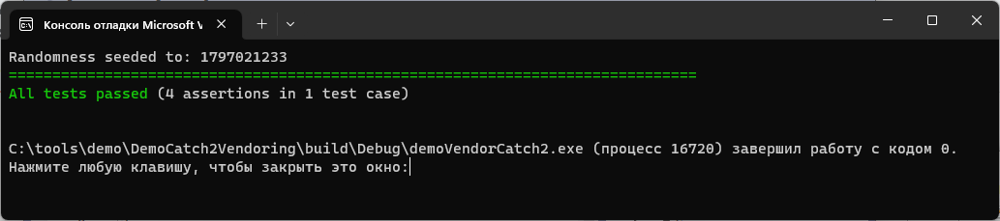

Демонстрация catch2 в режиме вендоринга (полной рабочей копии). Этот способ не является рекомендованным, он помогает, если "ну уж совсем никак не собирается". Советую попробовать решение через установку пакетного менеджера в [этом репозитории](https://github.com/antlas1/DemoCatch2Vcpkg)

### Сборка и проверка под Windows

Открываем консоль windows, переходим на путь, например `C:\projects`. 

<details>
<summary>Как открыть консоль, если есть проблемы</summary>
  
   * Запуск через меню Пуск:
     * Нажмите кнопку Пуск, которая находится в левом нижнем углу экрана
     * Найдите пункт «Командная строка» или «cmd» в списке программ
     * Нажмите на пункт «Командная строка» или «cmd» для запуска.
   * Запуск через диспетчер задач:
     * Нажмите `Ctrl + Shift + Esc`, чтобы открыть диспетчер задач
     * Нажмите на кнопку «Файл» в верхнем левом углу и выберите «Новый задачи»
     * В поле «Открыть» наберите «cmd» и нажмите Enter.
   * Запуск через Run:
     * Нажмите клавишу `Windows + R`
     * В появившемся окне введите «cmd» и нажмите Enter

   После чего вы должны увидеть примерно следующее окно:
      

</details>

Получаем проект из гита, создаём директорию сборки и конфигурируем для cmake+visual studio:

```
git clone https://github.com/antlas1/DemoCatch2Vendoring.git
cd DemoCatch2Vendoring
mkdir build
cd build
call "C:\Program Files\Microsoft Visual Studio\2022\Community\VC\Auxiliary\Build\vcvars64.bat"
cmake -G "Visual Studio 17 2022" -A "x64" ..
pause
```

Успешные шаги выглядят так:



После конфигурации открываем в студии и собираем:



Правой кнокой на проект **demoVendorCatch2**, делаем активным проектом (он выделится жирным), запускаем тесты:



### Для справки. Создание репозитория копией с catch2 с нуля

Как всё начиналось. Создал пустой репозиторий. Далее:

```
git clone https://github.com/antlas1/DemoCatch2Vendoring.git
cd DemoCatch2Vendoring
git clone https://github.com/catchorg/Catch2 catch2
```

Плюс, удалил каталог `.git` из catch2. 
Добавил `CMakeLists.txt`, где указал настройки проекта и поддиректорию с catch2.
